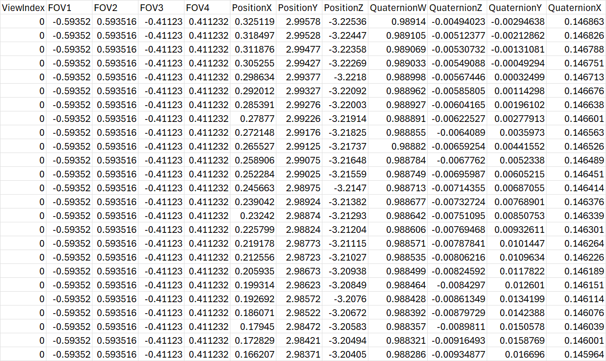

# Json Trace to CSV trace

## Overview
Convert traces from JSON files to CSV format.

## Example File Formats
1. **JSON**
Here's an example of the JSON format:(one frame)
```json
{
    "id": 0,
    "img_name": "DSC07956",
    "width": 1297,
    "height": 840,
    "position": [
        0.32511876709066195,
        2.9957802654512298,
        -3.225355003982969
    ],
    "rotation": [
        [
            0.9999338259558068,
            -0.010638588983250229,
            -0.004377685898681347
        ],
        [
            0.008907733496057774,
            0.9568136992250932,
            -0.2905653063584087
        ],
        [
            0.007279834705902121,
            0.2905070832176699,
            0.9568451487085131
        ]
    ],
    "fy": 963.0890448094842,
    "fx": 961.2246942396505,
    "is_key_frame": true
}
```
2. **CSV**
Here's an example of the CSV format converted:


## Installation

1. **Clone the repository**:
    ```bash
    git clone https://github.com/symmru/SIBR_Gaussian_VRV.git
    cd SIBR_Gaussian_VRV
    cd JsonTrace_toCsv
    ```

2. **Install required libraries**:
   - [Eigen](https://eigen.tuxfamily.org/dox/GettingStarted.html): Linear algebra library.
   - [nlohmann/json](https://github.com/nlohmann/json): JSON library for C++.

3. **Compile the code**:
   Compile the code using a C++ compiler like `g++` or `clang++`:
   ```bash
   g++ JsonToCSV.cpp -o main -I/path/to/nlohmann_json -I/path/to/eigen3 -std=c++17
   ```
4. **Run the code**
    ```bash
    ./JsonToCSV <input_json_file_path> <output_csv_file_path>
    ```
