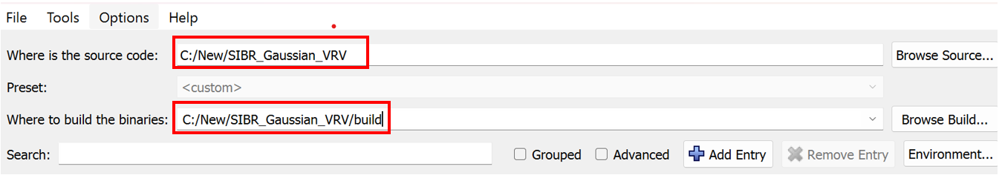
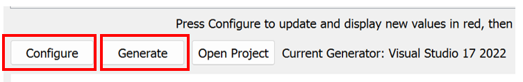
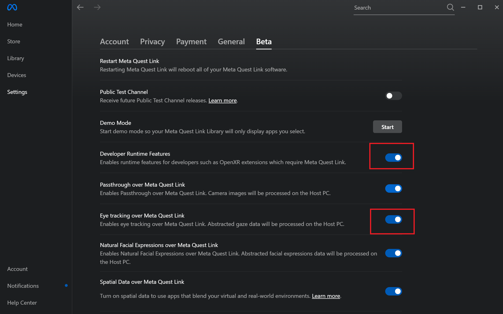
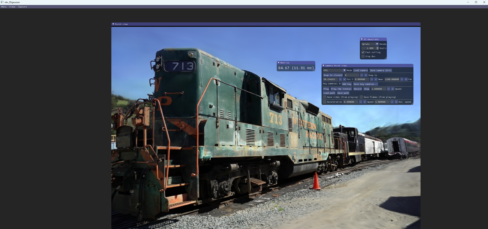
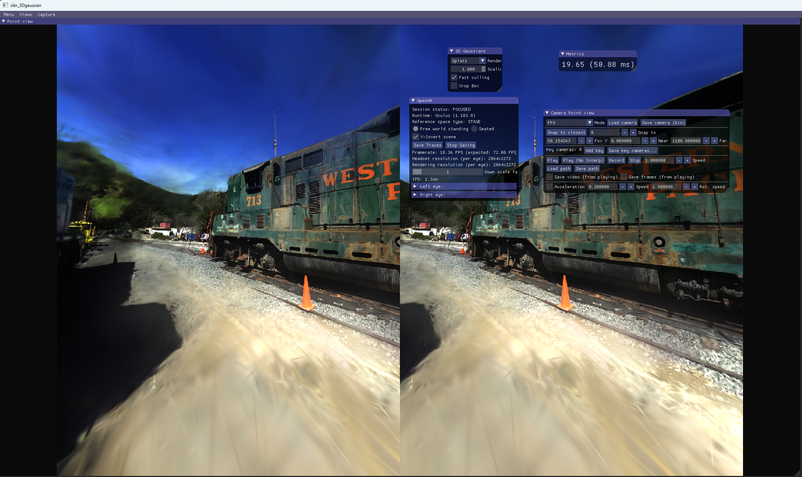
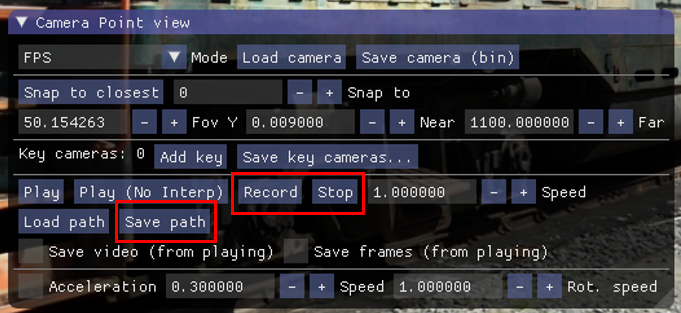
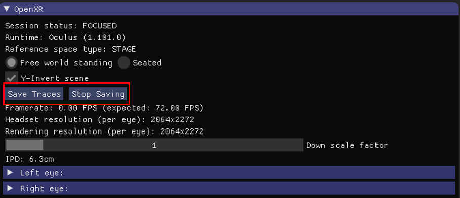
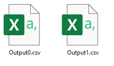
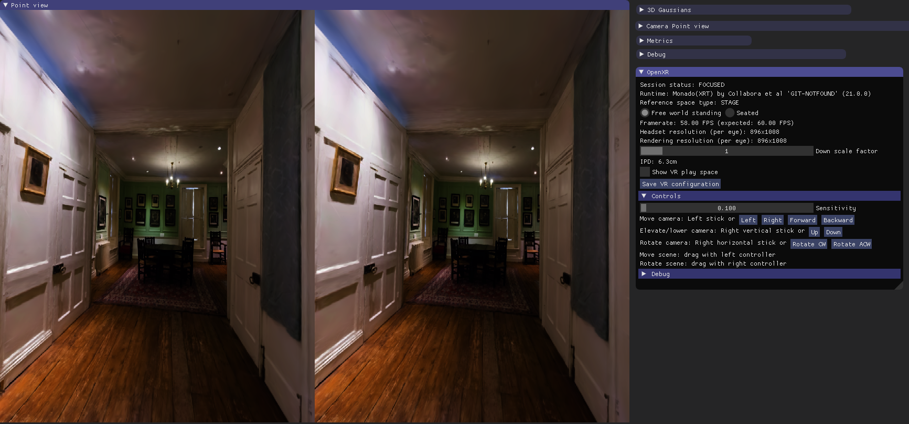

# Environment Setup

1. **Clone the repository:**
   ```sh
   git clone https://github.com/symmru/SIBR_Gaussian_VRV.git
   ```

2. **Install requirements and ensure they are in your PATH:**

    Follow the [Install requirements](#install-requirements) and make sure they are in the PATH, run the command below to test:

   ```sh
   python --version
   doxygen --version
   nvcc --version
   cmake --version
   ```


# Compilation

1. **Generate Visual Studio project with CMake-GUI:**
   - Open CMake-GUI.
   
       

   - Set the source directory to the repository root and the build directory to `build/`.

        

   - Click "Configure" and select the Visual Studio C++ Win64 compiler.
   - Select the desired BUILD options and then click "Generate".
        


2. **Compile using Visual Studio:**
   - Open `build/sibr_projects.sln` in Visual Studio.
   - For the `core/sibr_openxr` project, set the C++ standard to C++20 or higher.
   - Build the `ALL_BUILD` target, then the `INSTALL` target.

   The resulting executables will be placed in `install/bin`. The main executable is:
   ```
   SIBR_gaussianViewer_app_d.exe
   ```

   Ensure `install/bin` is in your PATH.


# The SIBR VR Viewer

The SIBR VR Viewer allows users to visualize 3D Gaussian Splatting scenes either in a Desktop (non-VR) environment or through a VR headset using OpenXR.

For more detailed documentation on the SIBR core system, please refer to the original [SIBR Core](#sibr-core) section and documentation.

## Desktop Mode

**What is Desktop Mode?**  
Desktop mode runs the viewer as a monocular 2D application on the computer monitor. You can interact using a keyboard and mouse. This mode is useful for saving traces and recording camera paths without needing a VR headset.

## Headset Mode

**What is Headset Mode?**  
Headset mode uses OpenXR to stream stereoscopic views to a VR headset. This mode immerses the user inside the virtual environment, allowing movement tracking through head movements. This is ideal for VR demonstrations, immersive walkthroughs, or data collection via a head-mounted display.


# Starting the SIBR VR Viewer

## Eye Gaze Tracking Settings

If you use Meta Quest Pro and want to use the Eye gaze tracking funtion, you need to follow these steps for setting up:

1. Download the specific version of Meta Quest Link app: https://www.oculus.com/download_app/?id=1582076955407037
2. Then you should start with a developer account in the Meta Quest Link and your headset: https://auth.oculus.com/login/?redirect_uri=https%3A%2F%2Fdeveloper.oculus.com%2Fmanage
3. Creating developer account needs two-step authentication or adding payment.
4. When you logged in, you should open the developer mode and eye tracking permission. 

   
5. Make sure that you have activated the eye tracking function on the Quest pro headset and calibrated.

## Command Line Arguments

The main arguments include:

- `-m <dataset_path>`: Specifies the dataset (model) path.
- `--rendering-mode <mode>`: Selects the rendering mode.
  - `0`: Monocular desktop mode (manual navigation)
  - `1`: Stereo anglaph desktop mode (manual navigation)
  - `2`: Headset mode (VR)
  - `3`: Headset mode replay (VR)
  - `4`: Monocular desktop mode replay
- `--initial-position <x> <y> <z>`: Set the initial position of the headset space.
- `--initial-quaternion <X> <Y> <Z> <W>`: Set the initial orientation of the headset space using a quaternion.
- `--initial-scale <float>`: Set the initial scale of the user’s "virtual body" (affects perceived size of the world).
- `-in <trace_file_path>`: Specifies a recorded trace file to replay.
- `--rendering-size <width> <height>`: Sets window size for desktop replay mode.

## Example Scene Models
**1. Gaussian Splatting dataset**

Download the following pretrained models from:
   ```
   https://repo-sam.inria.fr/fungraph/3d-gaussian-splatting/datasets/pretrained/models.zip
   ```
Extract it into a directory of your choice (e.g., `C:\User\SIBR\models`). The following table gives some reference values for initialization of the viewer:

| Dataset_Name | Initial Position (x y z)     | Quaternion (X Y Z W)                             | Scale (float)        |
|--------------|------------------------------|--------------------------------------------------|----------------------|
| truck        | --initial-position -2 1.8 -4 |--initial-quaternion -0.0872 0.0000 0.0000 0.9962 |--initial-scale 0.8   |
| treehill     |--initial-position  2 1 2     |--initial-quaternion -0.2164 0.0000 0.0000 0.9763 |--initial-scale 1     |
| train        |--initial-position  2 0 3     |--initial-quaternion 0.0872 0.0000 0.0000 0.9962  |--initial-scale 0.2   |
| stump        |--initial-position  -1 1.1 -2 |--initial-quaternion -0.4226 0.0000 0.0000 0.9063 |--initial-scale 3     |
| room         |--initial-position  0 1.1 0   |--initial-quaternion -0.2164 0.0000 0.0000 0.9763 |--initial-scale 2     |
| playroom     |--initial-position  0 0.8 0   |--initial-quaternion -0.2164 0.0000 0.0000 0.9763 |--initial-scale 2     |
| kitchen      |--initial-position  0.6 0.7 0 |--initial-quaternion -0.3420 0.0000 0.0000 0.9397 |--initial-scale 5     |
| garden       |--initial-position  4 1.7 1   |--initial-quaternion -0.2588 0.0000 0.0000 0.9659 |--initial-scale 1     |
| flowers      |--initial-position  0 0 -2    |--initial-quaternion 0.1305 0.0000 0.0000 0.9914  |--initial-scale 1     |
| drjohnson    |--initial-position  0 1.5 0   |--initial-quaternion -0.2126 0.2126 0.6744 0.6744 |--initial-scale 1     |
| counter      |--initial-position  0 1 -0.3  |--initial-quaternion -0.3007 0.0000 0.0000 0.9537 |--initial-scale 4     |
| bonsai       |--initial-position  0.7 1 -1  |--initial-quaternion -0.3420 0.0000 0.0000 0.9397 |--initial-scale 3     |

**2. Zip-NeRF dataset**

Download the models (Zip-NeRF) from:
```
https://smerf-3d.github.io/#data
```

| Dataset_Name | Initial Position (x y z)     | Quaternion (X Y Z W)                             | Scale (float)        |
|--------------|------------------------------|--------------------------------------------------|----------------------|
| nyc          |--initial-position  3 0 -3    |--initial-quaternion -0.1305 0.0000 0.0000 0.9914 |--initial-scale 0.4   |
| london       |--initial-position  -8 -2.7 -2|--initial-quaternion -0.0436  0.0000 0.0000 0.9990|--initial-scale 0.4   |
| berlin       |--initial-position  0 -4 0    |--initial-quaternion 0.04345 0.0038 -0.0870 0.9952|--initial-scale 0.6   |
| alameda      |--initial-position  -2.5 -1.5 -1.5  |--initial-quaternion -0.1736 0.0000 0.0000 0.9848|--initial-scale 0.4|


> **Note:** 
>- The values of this table can only be used in Headset Mode.
>- How to use them? Please read [Headset Mode](#headset-mode-1).
>- If you **recorded a trace** using specific initial settings, you have to also use the same settings to **replay this trace**. Or you will get output videos in other locations, orientations and scales.
>- How to modify the values:
   >- 1. Position: +x: right, +y: up, +z: backward
   >- 2. Orientation: degrees: +x: downward, +y: right, +z: clockwise (then convert to quaternion)
   >- 3. Scale: 1 is default value, the higher it is, the smaller the world is.(your body is bigger)
   >- 4. To be attention, the above parameters control the Initial Position, Initial Orientation and Scale of Headset Space instead of two eyes.
   >- In Headset space, both eyes are positioned relative to the origin, and the Headset Space itself is placed within the world coordinate system.

## Desktop Mode

**Example command for starting the SIBR viewer in desktop mode:**
```sh
SIBR_gaussianViewer_app_d.exe -m C:\User\SIBR\models\train --rendering-mode 0
```
  
You will see a window with the scene rendered as a 2D view. Interact using your mouse and keyboard.




## Headset Mode

**Example command for starting the SIBR viewer in headset mode:**
```sh
#Without initial settings
SIBR_gaussianViewer_app_d.exe -m C:\Users\SIBR\models\train --rendering-mode 2 
#With initial settings
SIBR_gaussianViewer_app_d.exe -m C:\Users\SIBR\models\train --rendering-mode 2 --initial-position 2 0 3 --initial-quaternion 0.0872 0.0000 0.0000 0.9962 --initial-scale 0.2
```

With a supported OpenXR runtime (such as SteamVR on PC or Oculus Link on Windows), you can view and move around in the scene using a VR headset. And you can also see a window with 2 subwindows on the Desktop representing two eyes' views in the Headset.



# Trace Recording

You can record the camera’s movement trajectory (position), field-of-view (FOV), and orientation (quaternion) for future replay.

## Desktop Mode

- Start the viewer in desktop mode. Then you can see a subwindow on the desktop as shown below:

    

- Click “Record” to start recording your camera path.
- Click “Stop” to end the recording.
- Click “Save path” to choose a location to save the recorded `.csv` file.

## Headset Mode
- Start the viewer in headset mode. Then you can see a subwindow on the desktop as shown below:

     

- Press “Save Traces” to start recording your head movements and FOV as you move in VR.
- Press “Stop Saving” to end recording.
- The output files (`output[number].csv`) are saved in the current directory.

     

# Format of Recorded Traces

The recorded traces are stored in `.csv` files. Each row corresponds to a captured frame/state of the viewer.

| ViewIndex |   FOV1    |   FOV2    |   FOV3    |   FOV4    | PositionX  | PositionY  | PositionZ  | QuaternionX | QuaternionY | QuaternionZ | QuaternionW |
|-----------|-----------:|----------:|----------:|----------:|-----------:|-----------:|-----------:|------------:|------------:|------------:|------------:|
| 0         | -0.94248   | 0.698132  | -0.95993  | 0.767945  | 0.003914   | 0.895811   | -0.07397   | 0.257321    | -0.107277   | -0.030081   | 0.959882    |
| 1         | -0.69813   | 0.942478  | -0.95993  | 0.767945  | 0.065237   | 0.888708   | -0.06199   | 0.257321    | -0.107277   | -0.030081   | 0.959882    |
| 0         | -0.94248   | 0.698132  | -0.95993  | 0.767945  | 0.002297   | 0.89517    | -0.0753    | 0.254336    | -0.107171   | -0.0282334  | 0.960745    |
| 1         | -0.69813   | 0.942478  | -0.95993  | 0.767945  | 0.063636   | 0.88833    | -0.06326   | 0.254336    | -0.107171   | -0.0282334  | 0.960745    |
| 0         | -0.94248   | 0.698132  | -0.95993  | 0.767945  | 0.002278   | 0.895369   | -0.07456   | 0.254109    | -0.108516   | -0.0283014  | 0.960652    |
| 1         | -0.69813   | 0.942478  | -0.95993  | 0.767945  | 0.06358    | 0.888482   | -0.06235   | 0.254109    | -0.108516   | -0.0283014  | 0.960652    |
* ViewIndex: Index used to identify left eye or right eye, 0 is left, 1 is right.  
* FOV1: The left field of view angle.  
* FOV2: The right field of view angle.  
* FOV3: The top field of view angle.  
* FOV4: The bottom field of view angle.  
* PositionX,Y,Z: The camera's position coordinates in 3D space, defining where the camera is located.  
* QuaternionX,Y,Z,W: Defines the camera's rotation as a quaternion, which represents 3D rotations without the risk of gimbal lock.


# Trace Replay

To replay a previously recorded trace, you can use the command line arguments described above in the [Command Line Arguments](#command-line-arguments) section. Make sure to specify the input trace file and select the appropriate rendering mode.

## Desktop Mode

**Example command for desktop mode replay:**
```sh
SIBR_gaussianViewer_app_d.exe -m C:\User\SIBR\models\train -in C:\User\SIBR\Test\trace.csv --rendering-mode 4 --rendering-size 1200 900
```
If no `--rendering-size` is provided, default is 1200x789.

## Headset Mode

**Example command for headset mode replay:**
```sh
#Without initial settings
SIBR_gaussianViewer_app_d.exe -m C:\User\SIBR\models\train -in C:\User\SIBR\Test\output0.csv --rendering-mode 3 --rendering-size 1200 900
#With initial settings
SIBR_gaussianViewer_app_d.exe -m C:\Users\SIBR\models\train --rendering-mode 3 --initial-position 2 0 3 --initial-quaternion 0.0872 0.0000 0.0000 0.9962 --initial-scale 0.2
```
If no `--rendering-size` is provided, default size for each eye is 2064x2272.


---

# SIBR Core

**SIBR** is a System for Image-Based Rendering.  
It is built around the *sibr-core* in this repo and several *Projects* implementing published research papers.  
For more complete documentation, see here: [SIBR Documentation](https://sibr.gitlabpages.inria.fr) 
  
This **SIBR core** repository provides :
- a basic Image-Based Renderer
- a per-pixel implementation of Unstructured Lumigraph (ULR)
- several dataset tools & pipelines do process input images
  
Details on how to run in the documentation and in the section below.  
If you use this code in a publication, please cite the system as follows:

```
@misc{sibr2020,
   author       = "Bonopera, Sebastien and Esnault, Jerome and Prakash, Siddhant and Rodriguez, Simon and Thonat, Theo and Benadel, Mehdi and Chaurasia, Gaurav and Philip, Julien and Drettakis, George",
   title        = "sibr: A System for Image Based Rendering",
   year         = "2020",
   url          = "https://gitlab.inria.fr/sibr/sibr_core"
}
```
## OpenXR

This branch supports headed-mounted displays through [OpenXR](#use-a-vr-headset). 


## Setup

**Note**: The current release is for *Windows 10* only. Please not that Visual Studio with c++20 standard is required to compile. We are planning a Linux release soon.

#### Binary distribution

The easiest way to use SIBR is to download the binary distribution. All steps described below, including all preprocessing for your datasets will work using this code.

Download the distribution from the page: https://sibr.gitlabpages.inria.fr/download.html (Core, 57Mb); unzip the file and rename the directory "install".

#### Install requirements

- [**Visual Studio 2019**](https://visualstudio.microsoft.com/fr/downloads/)
- [**Cmake 3.16+**](https://cmake.org/download)
- [**7zip**](https://www.7-zip.org)
- [**Python 3.8+**](https://www.python.org/downloads/) for shaders installation scripts and dataset preprocess scripts
- [**Doxygen 1.8.17+**](https://www.doxygen.nl/download.html#srcbin) for documentation
- [**CUDA 10.1+**](https://developer.nvidia.com/cuda-downloads) and [**CUDnn**](https://developer.nvidia.com/cudnn) if projects requires it

Make sure Python, CUDA and Doxygen are in the PATH

If you have Chocolatey, you can grab most of these with this command:

```sh
choco install cmake 7zip python3 doxygen.install cuda

## Visual Studio is available on Chocolatey,
## though we do advise to set it from Visual Studio Installer and to choose your licensing accordingly
choco install visualstudio2019community
```

#### Generation of the solution

- Checkout this repository's master branch:
  
  ```sh
  ## through HTTPS
  git clone https://gitlab.inria.fr/sibr/sibr_core.git -b master
  ## through SSH
  git clone git@gitlab.inria.fr:sibr/sibr_core.git -b master
  ```
- Run Cmake-gui once, select the repo root as a source directory, `build/` as the build directory. Configure, select the Visual Studio C++ Win64 compiler
- Select the projects you want to generate among the BUILD elements in the list (you can group Cmake flags by categories to access those faster)
- Generate

#### Compilation

- Open the generated Visual Studio solution (`build/sibr_projects.sln`)
- Build the `ALL_BUILD` target, and then the `INSTALL` target
- The compiled executables will be put in `install/bin`
- TODO: are the DLLs properly installed?

#### Compilation of the documentation

- Open the generated Visual Studio solution (`build/sibr_projects.sln`)
- Build the `DOCUMENTATION` target
- Run `install/docs/index.html` in a browser


## Scripts

Some scripts will require you to install `PIL`, and `convert` from `ImageMagick`.

```sh
## To install pillow
python -m pip install pillow

## If you have Chocolatey, you can install imagemagick from this command
choco install imagemagick
```

## Troubleshooting

#### Bugs and Issues

We will track bugs and issues through the Issues interface on gitlab. Inria gitlab does not allow creation of external accounts, so if you have an issue/bug please email <code>sibr@inria.fr</code> and we will either create a guest account or create the issue on our side.

#### Cmake complaining about the version

if you are the first to use a very recent Cmake version, you will have to update `CHECKED_VERSION` in the root `CmakeLists.txt`.

#### Weird OpenCV error

you probably selected the 32-bits compiler in Cmake-gui.

#### `Cmd.exe failed with error 009` or similar

make sure Python is installed and in the path. 

#### `BUILD_ALL` or `INSTALL` fail because of a project you don't really need

build and install each project separately by selecting the proper targets.

#### Error in CUDA headers under Visual Studio 2019

make sure CUDA >= 10.1 (first version to support VS2019) is installed.

## To run an example

For more details, please see the documentation: http://sibr.gitlabpages.inria.fr

Download a dataset from: https://repo-sam.inria.fr/fungraph/sibr-datasets/

e.g., the *sibr-museum-front* dataset in the *DATASETS_PATH* directory.

```
wget https://repo-sam.inria.fr/fungraph/sibr-datasets/museum_front27_ulr.zip
```

Once you have built the system or downloaded the binaries (see above), go to *install/bin* and you can run:
```
	sibr_ulrv2_app.exe --path DATASETS_PATH/sibr-museum-front
```

You will have an interactive viewer and you can navigate freely in the captured scene. 
Our default interactive viewer has a main view running the algorithm and a top view to visualize the position of the calibrated cameras. By default you are in WASD mode, and can toggle to trackball using the "y" key. Please see the page [Interface](https://sibr.gitlabpages.inria.fr/docs/nightly/howto_sibr_useful_objects.html) for more details on the interface.

Please see the documentation on how to create a dataset from your own scene, and the various other IBR algorithms available.

### Support for VR headsets using OpenXR (provided by Orange)


* The new SIBR rendering mode `OpenXRRdrMode` supports Headed-Mounted dislay (HMD) OpenXR devices.
* The GaussianViewer can use this rendering mode with `--rendering-mode 2` option to render 3D Gaussian Splatting scene to two-view headset display through OpenXR stack.
* This mode works on Windows and Linux (through the SteamVR OpenXR runtime).

_Note: `OpenXRRdrMode` does not (yet) support actions (aka controller buttons). But two VR experience modes are available:_
* Free world standing: only the headset's displacement allows motion within the 3DGS scene
* Seated: controls with keyboard or mouse are available in addition to headset's displacement

---
**How to test:**

**Windows (Meta Quest 1/2/3/Pro):**

1. Install the Desktop PC Oculus Application: https://www.meta.com/en-gb/help/quest/articles/headsets-and-accessories/oculus-rift-s/install-app-for-link/
2. Setup Quest Link: https://www.meta.com/en-gb/help/quest/articles/headsets-and-accessories/oculus-link/set-up-link/
3. The headset should be in the Oculus AirLink Home screen (white background)
4. Run `gaussianViewer -m <dataset_path> --rendering-mode 2`



5. You can try `Free world standing` and `Seated` VR experiences
6. If you are experiencing lags in the headset, try to lower the rendering resolution by changing the `Down scale factor` slider value.

**Linux (through Steam):**

1. Install Steam and SteamVR
2. Make SteamVR the OpenXR default runtime (Settings > OpenXR > SET STEAMVR AS OPENXR RUNTIME)
3. Restart SteamVR
4. Run `gaussianViewer -m <dataset_path> --rendering-mode 2`

Tested with an HTC Vive Pro with `beta - SteamVR Beta Update` on Ubuntu distribution and Meta Quest 2 with `Oculus` on Windows 11.

